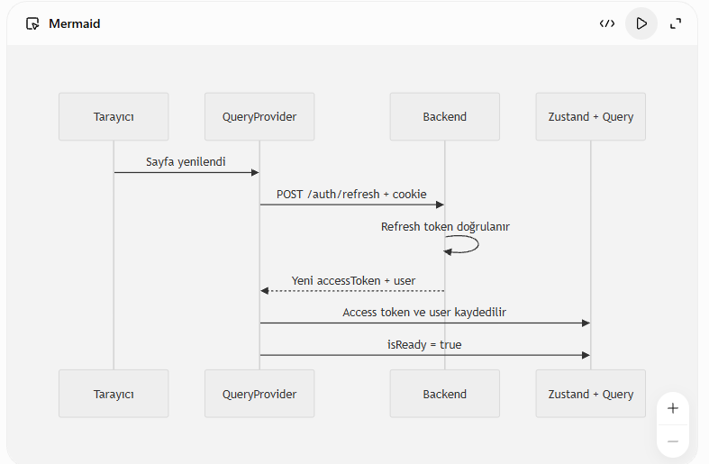
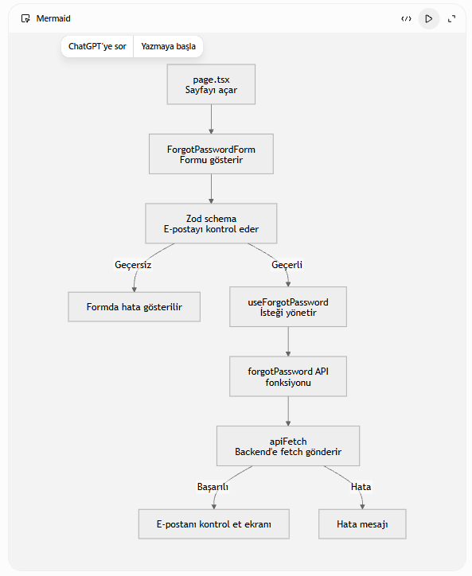

#### Toekn Yenileme Mimarisi ####

Refresh başarılı olursa:
setAccessToken(data.accessToken);
queryClient.setQueryData(["currentUser"], data.user);
Böylece kullanıcı yeniden login olmuş gibi devam ediyor.

isReady neden var?

Sayfa ilk açıldığında frontend henüz refresh isteğinin sonucunu bilmiyor.

Başlangıçta:

isReady: false

Bu sırada RequireAuth kullanıcıyı hemen login sayfasına göndermiyor:

if (!isReady) return;

Refresh işlemi bittikten sonra:

setIsReady(true);

oluyor.

Ondan sonra karar veriliyor:

if (!user) {
  router.replace("/login");
}

Yani isReady şu anlama geliyor:

“Backend’e refresh isteğini attım ve kullanıcının oturumu var mı yok mu artık biliyorum.”

Bu doğru ve gerekli bir yaklaşım. Yoksa kullanıcı aslında giriş yapmış olsa bile sayfa yenilenirken kısa süreliğine /login sayfasına gönderilirdi.

### Sifremi unuttum ###



**************************************
## ⚛️ React Hook Sırası Hatası
> [!CAUTION]
> **Hata mesajı**
> `React has detected a change in the order of Hooks called by SocialPage.`

> [!NOTE]
> **Neden oluşur?**
> `useRef`, `useEffect` ve `useState` gibi hook’lar her render sırasında aynı sırayla çalışmalıdır.
> Bir hook koşul içerisinde veya erken `return` işleminden sonra kullanılırsa hook sırası değişir ve React bu hatayı verir.
> **Çözüm**
> Bütün hook’ları component’in en üst seviyesinde çağır:
> - `if` koşullarının dışında
> - Döngülerin dışında
> - Erken `return` işlemlerinden önce
### ❌ Yanlış kullanım
```tsx
if (isLoading) {
  return <p>Yükleniyor...</p>;
}
const loadMoreRef = useRef<HTMLDivElement | null>(null);
**************************************